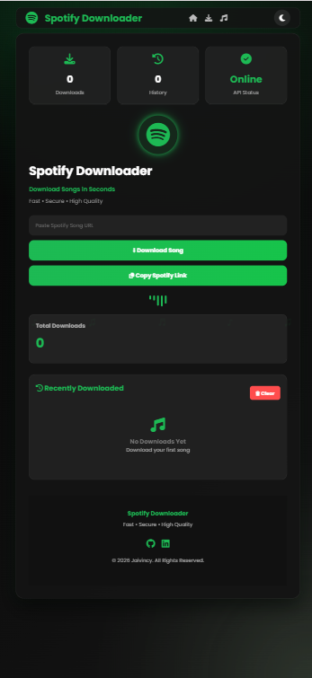
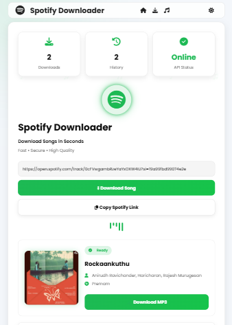

# 🎵 Spotify Downloader

A modern Spotify Downloader web application built using HTML, CSS and JavaScript.

---

## 🚀 Features

- Spotify Song Downloader
- Download History
- Local Storage
- Download Counter
- Dark / Light Mode
- Responsive Design
- Animated UI
- Toast Notifications
- Professional Dashboard
- Mobile Friendly

---

## 🛠 Technologies

- HTML5
- CSS3
- JavaScript
- RapidAPI
- Font Awesome

---

## 📷 Screenshots

### Home



### Download



### Mobile


---

## 🌐 Live Demo


---

## 📂 Installation

Clone the repository

```bash
git clone https://github.com/jaivincy/spotify-downloader.git
```

Open

```
index.html
```

---

## 👨‍💻 Author

Jaivincy

LinkedIn:
https://www.linkedin.com/in/jaivincy-v

GitHub:
https://github.com/jaivincy
